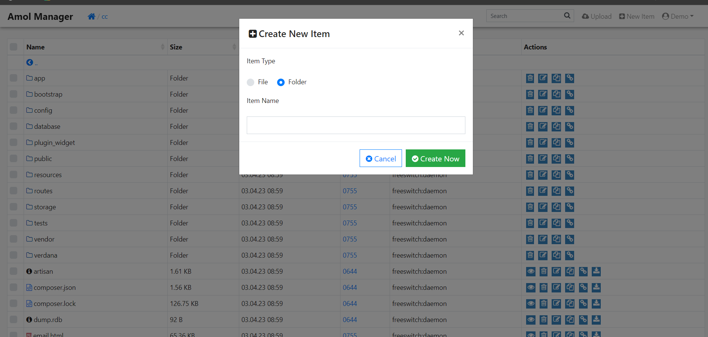
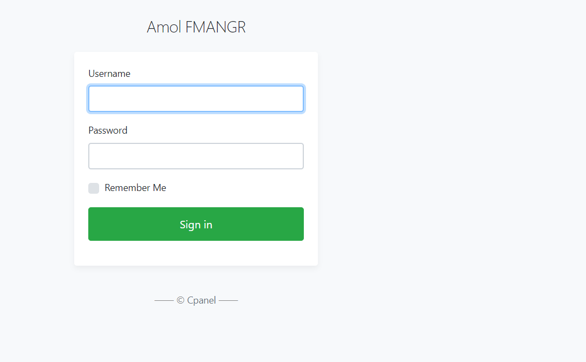
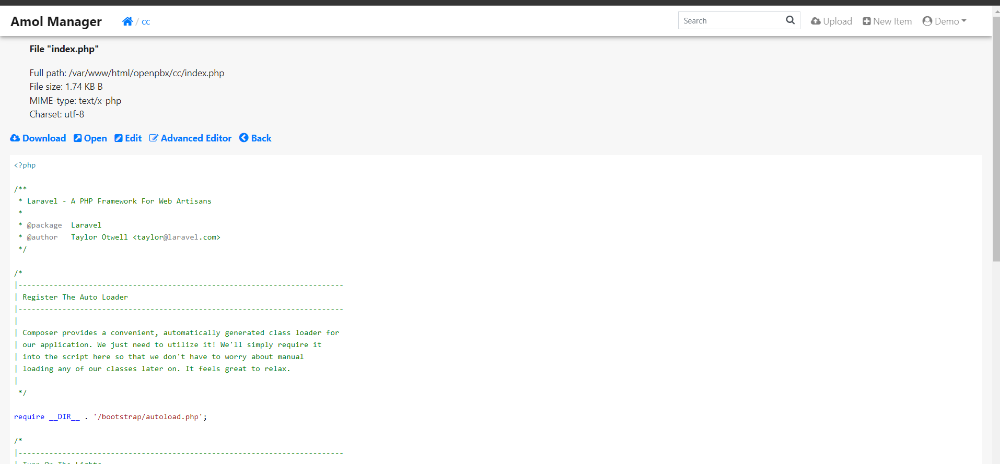
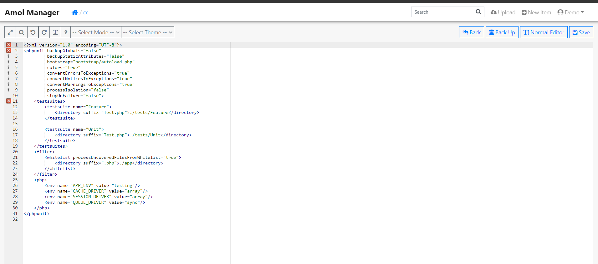
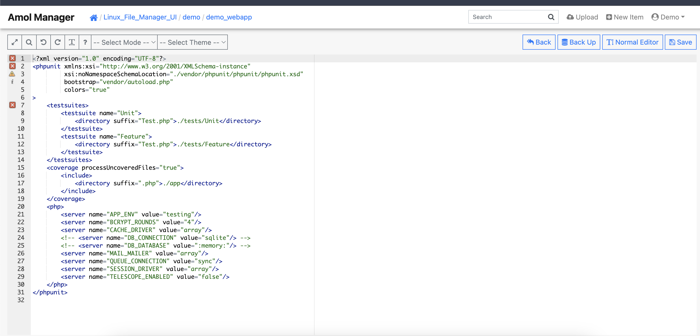
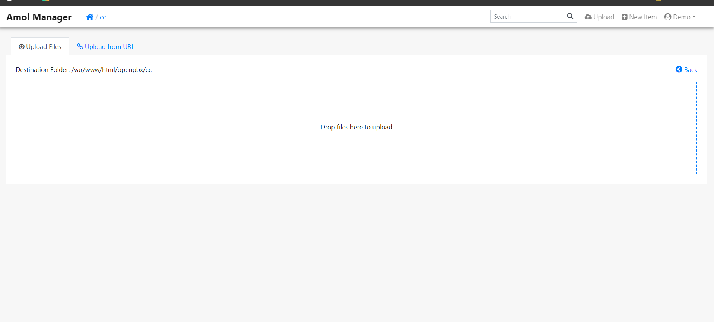
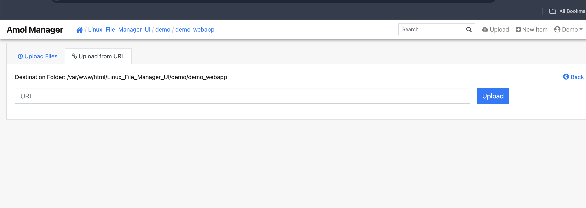

# PHP_Linux_File_Manager_UI
Linux File Manager (by PHP Web Server )
# Main UI

# Login  
-- Username Password set in index.php(Configure File) file as your requirement 
-- default username : demo password :demo1234

# file_preview

# file_Editor

# file_adv_editor

# upload

