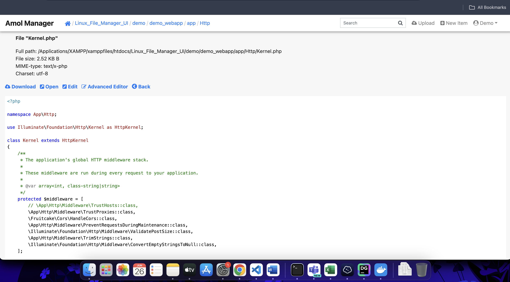
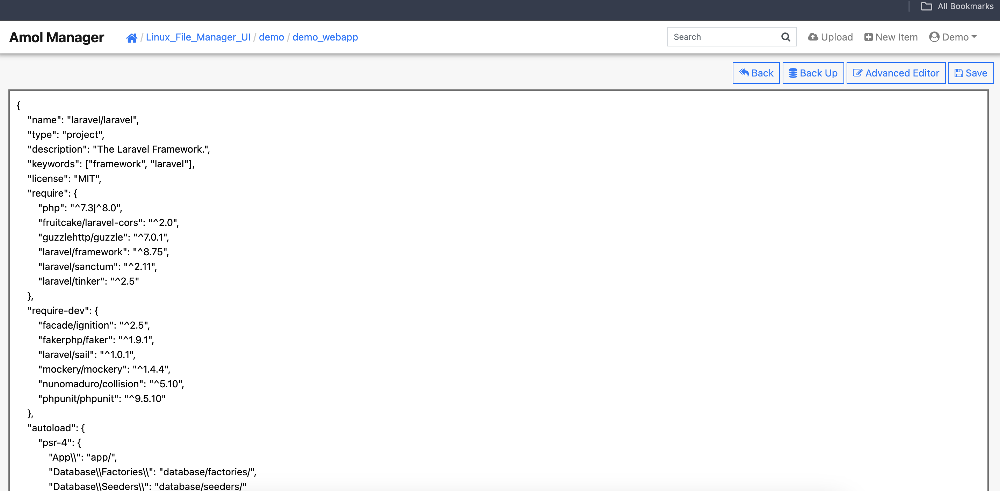

# PHP_Linux_File_Manager_UI
Linux File Manager (by PHP Web Server )
Amol FMANGR is a tool for managing content in linux Web Server Files. 
AmolFileManager organizes all the files in web servers access folders. 
Use the Amol File Manager interface to manage and edit your files.. 
Amol File Manger is distributed under Apache license in a form of a single PHP file.

# Main UI

# Login  
-- Username Password set in index.php(Configure File) file as your requirement 
-- default username : demo password :demo1234

# File Preview UI

# File Editor UI

# File Advance Editor UI

# Upload Files UI

#Docker
https://hub.docker.com/r/djamol/linuxwebfilemanger
Step
Step

docker pull djamol/linuxwebfilemanger:latest

docker run -p 8089:80 djamol/linuxwebfilemanger

Open URL http://localhost:8089

Demo Username:demo Password :demo1234

